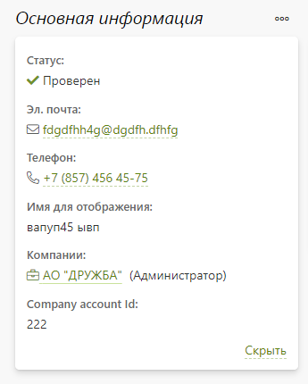
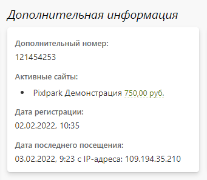
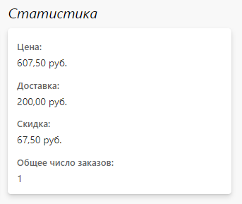

# Карточка частного лица

## Основная информация
* __Статус__ - положение клиента в системе:
    + __Зарегистрирован__ - устанавливается автоматически при регистрации клиента в системе.
    + __Проверен__ - может быть установлен сотрудником вручную, при оплате первого заказа, либо автоматически при регистрации, согласно настройкам раздела.
    + __Опасен__ - устанавливается сотрудником вручную, например, когда требуется дополнительная проверка заказов клиента, предоплата или согласование сроков исполнения.
    + __Заблокирован__ - устанавливается сотрудником вручную. Клиент с таким статусом не сможет совершить заказ на сайте.

> В разделе "Заказы" рядом с именем клиента всегда выводится иконка, соответствующая его статусу.

* __Эл. почта__ - электронная  почта клиента.
* __Телефон__ - мобильный телефон клиента.
* __Имя для отображения__ - заданное сотрудником имя клиента, либо заданное самим клиентом ФИО.
* __Дополнительный номер__ - внутренний номер клиента в системе, либо же назначенный сотрудником вручную (либо по API). Например, это может быть номер клиента во внешней системе для его идентификации.
* __Менеджер заказов__ - сотрудник компании, который является персональным менеджером.
* __Активные сайты__ - список сайтов, на которых клиент был зарегистрирован или авторизован, с отображением средств на личном счете по каждому из них.
* __Дата регистрации__ - дата и время регистрации в системе.
* __Дата последнего посещения__ - дата, время и IP-адрес, с которого клиент последний раз заходил на сайт.
<table>
<tr valign="top">
<td>  </td>
<td>  </td>
<td>  </td>
</tr>
</table>

## Товары в корзине
* Список товаров в корзине клиента по данному сайту компании.

## 3. Список заказов
* Список заказов клиента, которые можно отфильтровать по сайту, с которого заказ был оформлен, состоянию оплаты и статусу заказа.

## 4. Доступные скидки
* Список скидок, которые либо сейчас, либо ранее были доступны клиенту.

## 5. Личный счет
* Состояние личного счета со списком операций пополнения и списания в качестве оплаты за заказ.

## 6. Загруженные файлы
* Список файлов, загруженных в систему клиентом, или сформированных системой для работы редакторов, которые можно скачать или удалить.

## 7. Отправленные письма
* Список сформированных и отправленных по эл. почте клиенту писем-уведомлений.

## 8. Отправленные SMS-сообщения
* Список сформированных и отправленных SMS-уведомлений.

## 9. Примечания для сотрудников
* Список комментариев сотрудников компании в отношении клиента с возможностью размещения новых.
