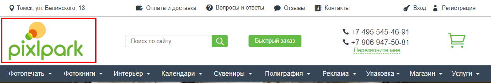
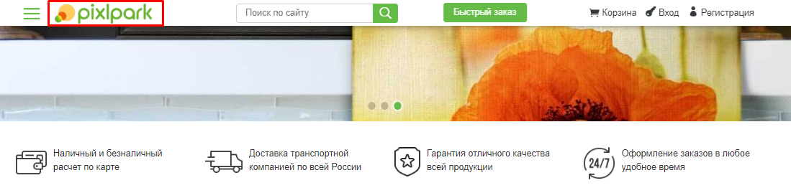
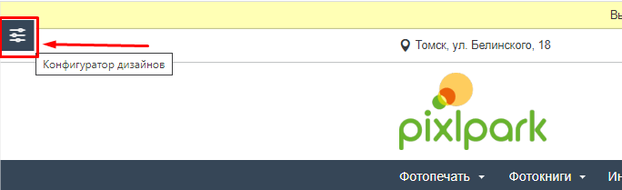
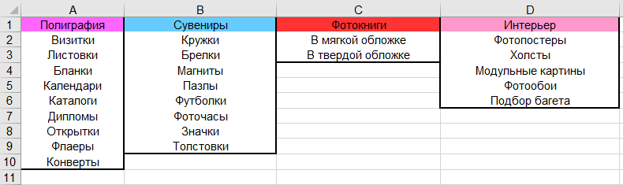
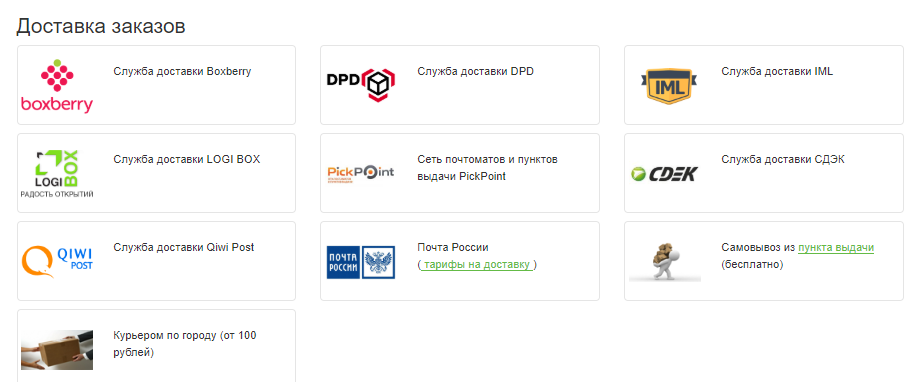
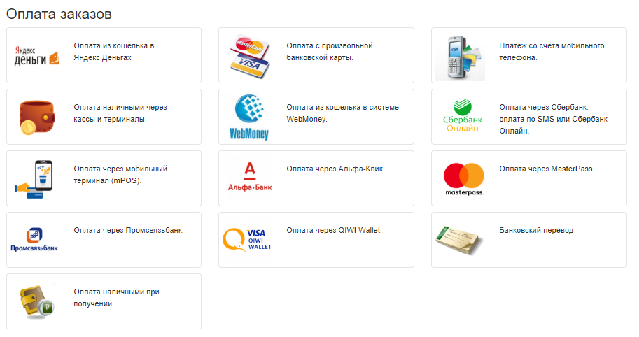

# Данные для первичной настройки печатного сайта
Ниже представлены данные, которые необходимо подготовить для проведения первичной настройки вашего сайта специалистами компании Pixlpark.

## 1. Два логотипа и фавикон
Основной логотип размещается в шапке сайта (формат: .png; ширина: от 220 до 350рх, высота: от 90 до 180рх).

Вспомогательный логотип размещается в скролируемом меню (формат: .png; ширина: от 120 до 180рх, высота: не более 32рх).

Фавикон размещается во вкладке браузера (формат: .ico или .png; ширина от 24 до 32рх, высота: от 24 до 32рх)

## 2. Контактные данные
- Адрес, эл. почта, телефон и мессенджеры (<a href="https://demo.pixlpark.ru/contact-us">пример</a>).
- Название бренда и реквитизы организации (<a href="https://demo.pixlpark.ru/requisites">пример</a>).
- Подпись и печать организации для счета (формат: .png).
- Группы и страницы в социальных сетях.

## 3. Оформление сайта
На <a href="https://demo.pixlpark.ru" target="_blank">демо-сайте</a> в левом верхнем углу в панели "Конфигуратор дизайном" можно ознакомиться с вариантами оформления шапки, меню и подвала.

Также необходимо определиться с двумя основными корпоративными цветами, которые будут использоваться взамен зеленого и оранжевого.

## 4. Структура меню
По аналогии с <a href="https://demo.pixlpark.ru" target="_blank">демо-сайтом</a> необходимо подготовить структуру меню, описав ее в отдельном эксель-файле.

## 5. Доставка и оплата
Для страницы <a href="https://demo.pixlpark.ru/delivery-and-payment" target="_blank">оплаты и доставки</a> необходимо перечислить возможные способы получения и оплаты заказа. 
Вы можете ознакомиться со списком интегрированных в Pixlpark платежных систем и транспортных компаний на <a target="_blank" href="https://pixlpark.ru/misc/shippings-and-payments">нашем сайте</a>.

