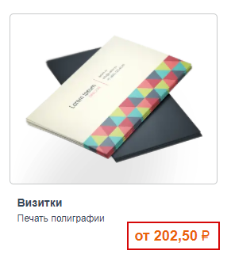
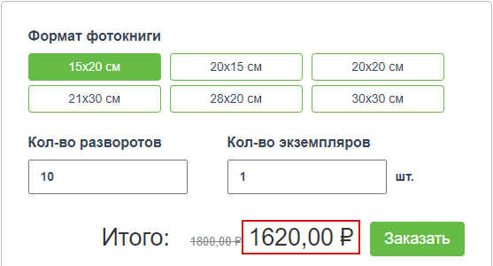
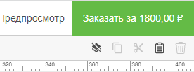
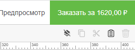

# Оформление заказов

## Основная информация
* 

Отображать стоимость в ценовых константах с учётом доступных скидок

    <table>
    <tr>
    <td>Базовая цена продукта без скидки. Отображается, когда параметр выключен.</td>
    <td>Цена продукта с учётом доступных скидок. Отображается, когда параметр включен.</td>
    </tr>
    <tr>
    <td>
    
    </td>
    <td>
    
    </td>
    </tr>
    </table>

* 

Отображать стоимость в редакторе и калькуляторе с учётом доступных скидок

    <table>
    <tr>
    <td>Базовая цена продукта без скидки. Отображается, когда параметр выключен.</td>
    <td>Цена продукта с учётом доступных скидок. Отображается, когда параметр включен.</td>
    </tr>
    <tr>
    <td>
    В калькуляторе
    
    </td>
    <td>
    В калькуляторе
    
    </td>
    </tr>
    <tr>
    <td>
    В редакторе
    
    </td>
    <td>
    В редакторе
    
    </td>
    </tr>
    </table>

* Отображать стоимость за единицу товара в корзине
* Отображать скидку как отрицательное число
* Отображать в корзине и в заказе артикул товаров
* Разрешить ввод карты оплаты на странице корзины
* Переходить к странице доставки после редактора, минуя страницу корзины
* Скрывать недоступные доставки при создании заказа
* Отображать вес на странице заказа
* Отображать дополнительный номер заказа вместо основного
* Разрешить клиентам отменять заказы до их перевода в статус "В работе"
* Разрешить оформление заказов, сумма которых меньше установленного ниже значения, оповестив об этом пользователя на странице корзины
* Разрешить в личном кабинете смену владельца заказа (между частным лицом и организацией, сотрудником которой он является)
* Не обновлять данные пользователя данными получателя заказа, вводимыми на странице доставки
* Разрешить дублирование заказов из личного кабинета пользователя
* Добавлять постфикс к дочерним заказам
* Запретить смену способа оплаты после оформления заказа
* Автоматически оплачивать заказы со счета организации
* Отображать сумму оплаты со счета пользователя как скидку
* Отключить автоматический выбор единственного способа оплаты на странице оплаты
* Использовать инвертированный порядок вывода адреса
* Скрывать в личном кабинете следующие типы заказов
* Запретить оформление заказа, если вес превышает (кг)
* Минимальная стоимость позиции (руб.)
* Минимальная стоимость заказа (руб.)
* Префикс номера заказа

## Быстрый заказ
* Включить механизм быстрого заказа на странице корзины
* Включить оформление заказа по телефону
* Разрешить оформление заказа без подтверждения номера телефона
* Включить оформление заказа по почте
* Запретить оформление заказа без выбора точки выдачи
* Автоматически оплачивать заказ со счета организации
* Ограничить оформление заказа следующими категориями раздела "Печать"
* Ограничить оплату следующими способами доставки
* Минимальная стоимость заказа (без учета скидок) (руб.)
* Максимальная стоимость заказа (без учета скидок) (руб.)

## Налогооблажение
* Считать НДС включенным в стоимость товара
* Выводить значение НДС на сайте отдельной строкой
* НДС для позиций заказа (%)
* НДС для доставки (%)