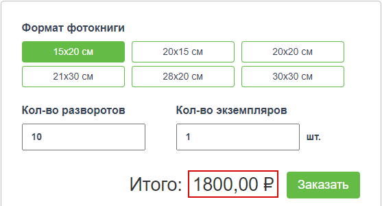
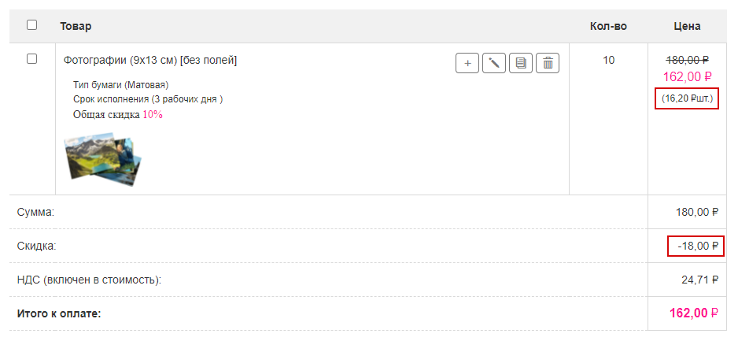

# Настройка
## Оформление заказов
### Основная информация
* В данном разделе представлены настройки, влияющие на процесс оформления заказа на сайте.
<table>
<tr>
<td></td>
<td></td>
</tr><tr>
<td colspan="2"></td>
</tr>
</table>

### Быстрый заказ
* В данном разделе представлены настройки, влияющие на логику поведения функции быстрого заказа на странице корзины.

### Налооблажение
* В данном разделе представлены настройки, влияющие на расчет и отображения НДС на странице корзины и заказа.

## Управление заказами
### Основные найстройки
* В данном разделе представлены настройки, влияющие на отображения заказов в панели управления.

### Время исполнения заказов
* В данном разделе представлены настройки, влияющие на автоматически расчёт времени исполнения заказов.
* При включении данного функционала во всех доставках появится блок "Время работы". Предполагается, что все способы доставки, где заданы эти значения, работают ежедневно, включая выходные и праздники. Далее, к каждому товару, требующему автоматический расчет времени готовности, необходимо привязать опцию срочности, а у каждой её позиции задать время исполнения, стоимость и ограничения по способам доставки.
* При оформлении заказа на сайте на те продукты, для которых создана опция срочности и существует связь с выбранным способом доставки (с заданным временем работы) будет автоматически расчитано время выдачи. Оно будет отображаться как клиенту на сайте, так и сотрудникам в панели управления. При желании его можно будет изменить вручную в карточке заказа. 

### Параметры страницы создания заказа по умолчанию
* В данном разделе представлены настройки, влияющие на установку параметров по умолчанию на странице создания заказа в панели управления. Установка предзаданных значений значительно упрощает и ускоряет процесс создания заказа.

* При использовнии Pixlpark в качестве CRM для учета офлайн-заказов мы рекомедуем:
   + Завести в системе анонимного клиента, к которому будете привязывать заказы всех, кто не захочет оставлять свои контактные данные. Его можно будет выбрать в качестве клиента по умолчанию.
   + Регистрировать все обращения на расчет от потенциальных клиентов в виде коммерческих предложений. Возможно, завтра он придет в офис и попросит оформить заказ, который вы для него считали. Тогда вам не потребуется заново заводить в системе заказ, а найти ранее созданный - поменять в нем тип и зарегистрировать клиента (прямо в карточке заказа).
   + Обязательно задать парамерты по умолчанию, выбрав значения, которые используются чаще других. Это сэкономит ваше время.

### Правила обработки заказов
* В данном разделе представлены правила автоматических действий над заказами (при выполнении определенных условий). Например, можно настроить изменение статуса заказа и отправку уведомления при получении оплаты или длительном нахождении в каком-то статусе.

## Отображение заказов
### Основная информация
* В данном разделе представлены настройки, влияющие на отображение заказов в панели управления.

### Скрипты и стили
* В данном разделе можно разместить собственный JS-код или CSS-стили, которые будут применяться для страниц панели управления. Например, можно написать скрипты и стили, чтобы "подсвечивать" заказы в списке c определенными товарами или срочностью.

## Выгрузка заказов
### Облачные хранилища
* В данном разделе можно настроить автоматическую выгрузку заказов в следующие облачные хранилища:
    + [Яндекс.Диск](https://disk.yandex.ru/)
    + [Облако Mail.ru](https://cloud.mail.ru/)
    + [Dropbox](https://www.dropbox.com/ru/)
    + [Google Диск](https://drive.google.com/)

* Подробнее о настройке читать в статье "[Интеграция с облачным хранилищем](/integration/drives)".

### ERP и CRM системы
* В данном разделе можно настроить автоматический экспорт заказов и обмен данными (включая калькуляцию) со следующими отраслевыми ERP и CRM-системами:
    + [Битрикс24](https://www.bitrix24.ru/)
    + [ASystem](https://monorhythm.ru/)/[PrintEffect](https://printeffect.ru/)
    + [HP Site Flow](https://hpsiteflow.com/)
    + [1С: Полиграфия](https://solutions.1c.ru/catalog/polygraphy)
    + [Принт-Эксперт](https://print-expert.net/)
    + Своё ПО (синхронизация по [API](/dev/api.md)).

## Локализация статусов
В данном разделе можно переименовать для сайта и панели управления статусы оплаты, статусы заказов и группы статусов.

## Шаблоны документов
### Карточка шаблона
* Шаблон - это форма документа, в которую может быть экспортирована информация о содержимом корзины или заказах для последующего анализа или печати.
* Например, шаблоном может быть любой бухгалтерский документ.
* В сервисе Pixlpark есть несколько готовых шаблонов:
    + Коммерческое предложение.
    + Презентация бизнес-сувениров.
    + Квитанция заказа.
    + Акт выполненных работ.
    + Товарный чек.
    + Товарный чек (с кодами товаров).
    + Товарная накладная (ТОРГ-12).
    + Почта России (форма 103).
    + Почта России (форма 113).
    + Почта России (форма 116).
* Вы можете создать свои собственные шаблоны на основе готовых, либо с нуля.
* Одна из основных характеристик шаблона - это его тип, который задается только в момент его создания (без возможности изменения в будущем). Шаблоны бывают нескольких типов:
    + __HTML шаблон__ - содержимое шаблона задается в виде HTML-разметки с использованием системных параметров, а на выходе формируется либо HTML, либо PDF-документ.
    + __HTML Scriban шаблон__ - содержимое шаблона задается в виде HTML-разметки с использованием [языка Scriban](/dev/scriban.md), а на выходе формируется либо HTML, либо PDF-документ.
    + __PDF шаблон__ - содержимое шаблона задается в виде размеченного специальным образом PDF-файла с использованием системных параметров, а на выходе формируется PDF-документ.
    + __Excel шаблон__ - содержимое шаблона задается в виде набора столбцов таблицы, соответствующих системным параметрам, а на выходе формируется CSV-документ.

#### Основная информация
* __Название__ - название шаблона, которое выводится как на сайте, так и в панели управления.
* __Выходной формат__ - выходной формат документа, в который сохраняется шаблон.
* __Язык сайта__ - язык сайта, для которого доступен шаблон.
* __Включить доступ, ограничить следующими типами заказчиков__ - включение или отключение доступности шаблона с заданием типа заказчиков, для которых он доступен (частные лица; организации).
* __Ограничить доступность следующими страницами__ - ограничение доступности шаблона для следующих страниц:
    + Страница корзины на сайте.
    + Страница ком. предложения на сайте.
    + Страница карточки заказа на сайте.
    + Страница карточки заказа и экспорта в панели управления.
* __Копировать шаблон при копировании сайта__ - копирование шаблона при копировании сайта.

#### Содержимое шаблона
* В данном разделе в зависимости от типа шаблона либо редактируется HTML-разметка шаблона, либо выбираются столбцы таблицы, либо загружается специальным образом размеченный PDF-файл.

### Список шаблонов
* В данном разделе представлен список шаблонов с указанием названия, языка доступности и выходного формата документов.
* Также на странице можно:
    + Добавить новый шаблон.
    + Перейти в карточку шаблона.
    + Удалить выделенные шаблоны.

